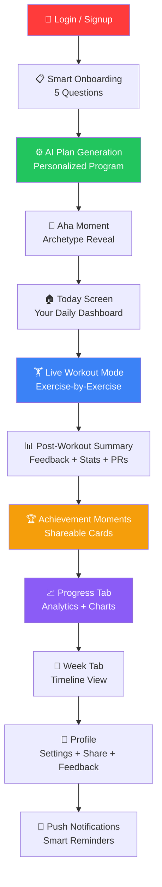

# Trainzy — Full Feature Audit & User Story
### Landing Page SOP: Every Working Feature, Login → Logout

> **Purpose:** This document maps every real, working feature of the Trainzy app in a conversion-friendly user story flow. Use this as the single source of truth for your trainzy.app landing page content. Every feature listed below is **verified from the actual codebase** — not aspirational.

---

## 🗺️ The Complete User Journey (At a Glance)

---

## Phase 1: 🔐 Authentication

### 1.1 — Login Screen
| What it does | How it works |
|---|---|
| **Email + Password login** | Standard Supabase Auth with validation |
| **Google Sign-In** | One-tap Google OAuth (Android native) |
| **Navigate to Signup** | Smooth transition to account creation |
| **Loading overlay** | Full-screen "Authenticating…" state with spinner |
| **Error handling** | Alert dialogs for failed login, cancelled Google sign-in |

**Landing Page Copy Angle:**
> *"Sign up in 30 seconds. Email or Google — your choice."*

### 1.2 — Signup Screen
| What it does | How it works |
|---|---|
| **Account creation** | Email + password registration via Supabase |
| **Success confirmation** | Alert → redirects back to login |
| **Brand identity** | Full Trainzy branding with logo |

---

## Phase 2: 📋 Smart Onboarding (5-Question Flow)

> **This is the conversion moment.** The onboarding is one of the strongest features for the landing page. It's fast, beautiful, and intelligent.

### Flow: `GOAL → LEVEL → ENVIRONMENT → FREQUENCY → LAST_WORKOUT`

Each question is shown one-at-a-time with:

| Feature | Detail |
|---|---|
| **Auto-advance** | Tapping an option auto-proceeds after 800ms (no "Next" button) |
| **Micro-feedback** | Instant contextual coaching message after each selection |
| **Progress bar** | Visual step indicator at top |
| **Animated transitions** | Fade + slide between questions |
| **Step indicator** | "1 of 5", "2 of 5", etc. |

### Question 1: Primary Goal
- 🔥 Weight Loss
- 💪 Muscle Gain
- ⚡ Body Recomposition
- 🏃 General Fitness

*Feedback example:* "Got it. We'll optimize for fat burn and lean muscle retention."

### Question 2: Experience Level
- 🌱 Beginner
- 📈 Intermediate
- 🏆 Advanced

*Feedback example:* "Perfect. This is where results come fastest."

### Question 3: Workout Location
- 🏠 Home
- 🏋️ Gym

*Feedback example:* "You'll get access to full equipment optimization."

### Question 4: Frequency
- 2–3 days
- 3–4 days
- 4–5 days
- 5+ days

*Feedback example:* "Strong. We'll optimize volume across sessions."

### Question 5: Last Workout
- Push / Pull / Legs / Full Body / Nothing recently

*Feedback example:* "Perfect. We'll structure your next session accordingly."

**Landing Page Copy Angle:**
> *"5 questions. 30 seconds. A fully personalized workout plan — no templates."*

---

## Phase 3: ⚙️ AI-Powered Plan Generation

### 3.1 — Plan Building Animation
| Feature | Detail |
|---|---|
| **Animated build sequence** | Multi-step animation showing plan being constructed |
| **Backend sync** | Program generated server-side while animation plays |
| **Dual-gate** | Animation AND backend must finish before advancing |
| **Analytics tracking** | `plan_generated` event with goal/level/user_id |

### 3.2 — Aha Moment Screen
| Feature | Detail |
|---|---|
| **Archetype classification** | User profiled into a training archetype based on their 5 answers |
| **Personalized insight** | Custom "Here's what we see" message with emoji |
| **Shift statement** | The one mental/physical shift Trainzy will focus on |

### 3.3 — Ready Screen
| Feature | Detail |
|---|---|
| **"Your first workout is ready"** | Confirmation screen with two CTAs |
| **Start Workout** | Jumps directly into the first workout |
| **View Plan** | Goes to the main dashboard to explore first |

**Landing Page Copy Angle:**
> *"We don't give you a template. We build a program that understands your body, your schedule, and your goals — in real time."*

---

## Phase 4: 🏠 Today Screen (Daily Dashboard)

> **This is the core screen users see every day.** It's the most content-rich screen for the landing page.

### 4.1 — Session Prediction Card
| Feature | Detail |
|---|---|
| **Gradient "Coach Insight" card** | Color-coded by state (Green = Progression, Amber = Recovery, Blue = Maintenance) |
| **Volume prediction** | Calculates predicted kg target based on last session |
| **Context-aware messaging** | Different messages for low energy, easy last session, bodyweight exercises |
| **Footer stats** | Shows last volume and target percentage |

**Three States:**
1. 🟢 **Progression** — "Your last session felt easy. We predict you can push for **{X}kg** total volume."
2. 🟡 **Recovery** — "Based on your low energy, we recommend a lighter load of **{X}kg** to focus on recovery."
3. 🔵 **Maintenance** — "Maintaining intensity to solidify your baseline."

### 4.2 — Adaptive Intelligence Banner
| Feature | Detail |
|---|---|
| **Dynamic coaching message** | "⚡ Today's plan updated" with reason |
| **Intensity badge** | HIGH / NORMAL / REDUCED pill |
| **Recovery badge** | Shows when recovery mode is activated |
| **Color-coded system** | Green (progression), Amber (recovery), Blue (normal) |

**Adaptation Rules (All Working):**
1. **Recovery Mode** — 2 consecutive low-energy sessions → Emergency deload (-40% volume)
2. **Missed Yesterday** — No progression, steady intensity
3. **High Energy + Streak ≥3** — Volume increased +10%
4. **Streak ≥5 + Normal Energy** — Volume boosted +5%
5. **Last Session Easy** — Progressive overload (+5-10%)
6. **Last Session Hard** — Deload (-10-20%)

### 4.3 — Exercise List
| Feature | Detail |
|---|---|
| **Grouped by section** | Warmup → Main exercises |
| **Step numbers** | Visual 1, 2, 3… ordering |
| **Type-aware targets** | "3 sets × 10-12 reps · 60s rest" OR "3 sets × 30s" for time-based |
| **Dynamic weights** | "Last: 40kg | Suggested: 42.5kg" |
| **Progression chips** | "↑ Increasing weight by 2.5kg" / "↓ Deloading by 5kg — recovery" / "→ Holding steady" |
| **ADAPTED badge** | Amber badge on exercises modified by the engine |
| **Category + Equipment badges** | UPPER BODY, BARBELL, DUMBBELL, etc. |
| **Tap for detail** | Bottom sheet with instructions, form cues, beginner tips, common mistakes |

### 4.4 — Lifecycle State Management
| State | What User Sees |
|---|---|
| **TRAINING_DAY** | Full exercise list + "Start Workout" button |
| **RECOVERY_DAY** | "Recovery Day" banner with next session date |
| **MISSED_TRAINING_DAY** | "Missed Session" warning with catch-up option |
| **SESSION_COMPLETED_TODAY** | ✅ "Session Finished" + Recovery Insight + Next session date |
| **PROGRAM_TRANSITION_PENDING** | "Program Phase Complete" + "Generate New Phase" button |

### 4.5 — Nudge System (Smart Banners)
| Nudge Type | Trigger | Message |
|---|---|---|
| **MISSED_YESTERDAY** | Didn't train yesterday | "Want a quick 20-min session today?" |
| **STREAK_CONTINUE** | Active streak ≥ 2 | "X-day streak. One more = your best this week." |
| **MOMENTUM_DROP** | 2+ days inactive | "Let's restart with something light." |
| **WEEKLY_REVIEW** | Monday | "Your weekly progress is ready." |

### 4.6 — Start Workout Button
- Big red CTA with play icon
- Passes the full adapted workout queue + type to WorkoutMode

**Landing Page Copy Angle:**
> *"Your dashboard doesn't just show you what to do — it tells you WHY. Every set, every weight, every rest period is adapted to how you actually performed yesterday."*

---

## Phase 5: 🏋️ Live Workout Mode

> **This is the full workout companion.** The most technically complex screen.

### 5.1 — Exercise-by-Exercise Progression
| Feature | Detail |
|---|---|
| **One exercise at a time** | Focus mode — no distracting full list |
| **Progress bar** | "Exercise 3 of 8 — 37%" with animated fill |
| **Live timer** | MM:SS elapsed time in top bar |
| **Back guard** | "Workout in Progress — your progress will be lost" confirmation |
| **App state handling** | Pauses timer when app goes to background, resumes on foreground |

### 5.2 — Set Logging (Type-Aware Inputs)
| Exercise Type | Inputs Shown |
|---|---|
| **Strength** | Weight (kg) + Reps |
| **Bodyweight** | Reps only |
| **Cardio** | Duration (seconds/minutes) |
| **Time-Based** | Duration |
| **Mobility** | Duration or Reps |

| Feature | Detail |
|---|---|
| **Weight pre-fill** | Auto-fills from last session or suggested weight |
| **Reps pre-fill** | Auto-fills from target reps |
| **Warmup toggle** | Switch to mark sets as warmup (excluded from volume) |
| **Haptic feedback** | Vibration on set completion |
| **Add extra set** | + button to add beyond target sets |
| **Edit completed sets** | Tap any logged set to edit weight/reps |

### 5.3 — Weight Intelligence (Confidence Tiers)
| Sessions Logged | What User Sees |
|---|---|
| **< 3 sessions** | "Establishing baseline. Focus on form and RPE 7." |
| **3-5 sessions** | "Last: 40kg | Target Range: 37.5-42.5kg" |
| **6+ sessions** | "Last: 40kg | Suggested: 42.5kg" with progression reason |

### 5.4 — Rest Timer
| Feature | Detail |
|---|---|
| **Full-screen overlay** | Dark overlay with pulsing circle |
| **Countdown display** | Large MM:SS timer |
| **Next exercise preview** | Shows name + target of upcoming exercise |
| **Skip button** | "Skip Rest →" to proceed immediately |
| **Haptic trigger** | Medium haptic when rest starts |

### 5.5 — Exercise Queue Management
| Feature | Detail |
|---|---|
| **Queue modal** | Full list with NOW, NEXT indicators |
| **Reorder exercises** | Up/down arrows to rearrange upcoming exercises |
| **Do Later** | Push current exercise to end of queue |
| **Remove exercise** | Delete with confirmation dialog |
| **Add exercise** | Search and add from 200+ exercise database |
| **Replace exercise** | Swap current exercise with another |

### 5.6 — Exercise Guide Modal
| Feature | Detail |
|---|---|
| **GIF/video placeholder** | Visual guide area (future: exercise GIFs) |
| **Target muscle** | Primary muscle group badge |
| **Step-by-step instructions** | Numbered instruction list |
| **Form cues** | Coach tips with lightbulb icons |
| **Common mistakes** | Warning-icon mistake list |

**Landing Page Copy Angle:**
> *"Train with a live companion. One exercise at a time. Smart rest timers. Auto-filled weights. Zero guesswork."*

---

## Phase 6: 📊 Post-Workout Summary

> **Sequential flow:** FEEDBACK → SUMMARY → ACHIEVEMENT → STREAK → DONE

### 6.1 — Feedback Phase
| Feature | Detail |
|---|---|
| **Energy level** | 🔋 Low / ⚡ Normal / ⚡ High (icon buttons) |
| **Difficulty rating** | 🍃 Easy / 🏋️ Perfect / 🔥 Hard |
| **Experience rating** | 👍 Good / 😐 Okay / 👎 Issue (opens bug report) |
| **"Complete Workout" CTA** | Saves session + feedback to Supabase |

> This feedback is what drives the adaptive engine for the NEXT session.

### 6.2 — Summary Phase
| Feature | Detail |
|---|---|
| **Celebration emoji** | 🏆 for full completion / 👏 for partial |
| **PR detection** | Real-time check against all historical sets in DB |
| **Streak display** | "🔥 Consistency streak: X days" |
| **Completion ratio** | "💪 Completed 6/8 exercises" |
| **Coach's Note** | Contextual message based on completion percentage |
| **Badges earned** | 🏅 First Workout / 🔥 X-Day Streak / 🏆 Personal Record |
| **Stats grid** | ⏱️ Duration / 💪 Exercises / 🔄 Sets |
| **Exercise breakdown** | Per-exercise completion with PR badge |

### 6.3 — Achievement / Moment System
| Moment Type | Trigger | Message |
|---|---|---|
| **FIRST_WORKOUT** | 1st ever session | "Day 1 Complete — The start of something great." |
| **PERSONAL_RECORD** | New max weight (+2.5kg) or max reps (+1) | "+X Improvement — New Personal Record" |
| **STREAK_MILESTONE** | 3, 7, 14, 30, 50, 100 day streaks | "🔥 X Day Streak — Consistency is key." |
| **PERFECT_SESSION** | 100% sets completed, 0 skipped | "Perfect Session — No sets skipped, full effort." |
| **CONSISTENCY_SCORE** | 70%+ weekly compliance | "Consistency: X% — You stayed on track." |
| **STRONGEST_WEEK** | Volume exceeds all-time weekly max | "Strongest Week — Most volume in a single week." |
| **COMEBACK** | 2+ days missed then returned | "Back Again 💪 — Never stay down for long." |

**Cooldown System:** Max 3 moments per week. 24h minimum between non-PR moments. PRs and first workout always bypass cooldown.

### 6.4 — Celebration + Share Phase
| Feature | Detail |
|---|---|
| **Confetti overlay** | Animated celebration on full completion |
| **"Share Your Workout" CTA** | Opens share card modal |
| **Return Home** | Navigates back to dashboard |

**Landing Page Copy Angle:**
> *"Every workout ends with insights, badges, and shareable cards. Your effort is never invisible."*

---

## Phase 7: 📈 Progress Tab (Analytics Dashboard)

### 7.1 — Streak Hero
- Giant 🔥 emoji + streak count
- Prominence: This is the centerpiece

### 7.2 — Three-Tab Layout
| Tab | Content |
|---|---|
| **Overview** | Stats grid + Weekly Volume Chart |
| **Muscles** | Muscle Distribution Chart + balance insights |
| **Exercises** | Personal Records per exercise |

### 7.3 — Overview Tab
| Feature | Detail |
|---|---|
| **Stats grid** | Current Streak, Total Workouts, This Week, Longest Streak |
| **Weekly Volume Chart** | Bar chart with W1, W2, W3… indexing (victory-native) |

### 7.4 — Muscles Tab
| Feature | Detail |
|---|---|
| **Muscle Distribution Chart** | Visual breakdown by muscle group |
| **Balance insight** | Textual insight about training balance |
| **Total workouts** | Session count |

### 7.5 — Exercises Tab
| Feature | Detail |
|---|---|
| **Personal Records** | Per-exercise top set (max weight or max reps) |
| **Max Volume** | Highest single-set volume |
| **Name resolution** | Maps exercise IDs to human-readable names from pool |

### 7.6 — Consistency Grid
- **GitHub-style contribution heatmap** showing daily workout history
- Built from user_events data with smart streak intelligence

### 7.7 — Workout Frequency Card
| Metric | Detail |
|---|---|
| **Avg / Week** | Calculated from total workouts ÷ active weeks |
| **This Week** | Current week count |
| **Badge** | 🎯 Consistent (≥3/week) or 🚀 Getting Started |

**Landing Page Copy Angle:**
> *"Track every rep, every PR, every streak. Visualize your muscle distribution, weekly volume trends, and consistency — all automatically."*

---

## Phase 8: 📅 Week Tab (Continuity Timeline)

### Visual Timeline
| Feature | Detail |
|---|---|
| **Vertical timeline** | Dot-and-line design connecting all sessions |
| **State-coded dots** | 🟢 Completed / 🔴 Target (pulsing) / ⚫ Upcoming / 🔴 Missed |
| **Date display** | "Mon, May 5" for completed/missed days |
| **Day cards** | Title + focus type + difficulty (if completed) |
| **Badges per day** | COMPLETED / TARGET / MISSED |

**Landing Page Copy Angle:**
> *"See your entire training arc. Past sessions, today's target, and what's coming next — all in one timeline."*

---

## Phase 9: 👤 Profile Screen

### 9.1 — User Info
- Display name (from Google or email prefix)
- Email address

### 9.2 — Share Your Stats
- **Premium "Share Your Stats" button** → Opens share card modal
- Generates shareable workout cards for social media

### 9.3 — Training Preferences (Editable)
| Field | Options | Impact |
|---|---|---|
| **Goal** | Weight Loss, Muscle Gain, General Fitness, Recomp | Triggers plan regeneration |
| **Experience Level** | Beginner, Intermediate, Advanced | Triggers plan regeneration |
| **Workout Location** | Home, Gym | Triggers plan regeneration |

**Edit Flow:**
1. Tap pencil icon → Edit Profile Modal
2. Change any field
3. Old program is archived (never deleted)
4. New program generated automatically
5. All history preserved (exercise_history, workout_sessions, user_events)

### 9.4 — App Settings
| Setting | Detail |
|---|---|
| **Push Notifications** | Toggle on/off with Supabase preference sync |

### 9.5 — Beta Feedback System
| Action | Detail |
|---|---|
| **🐛 Report a Bug** | Opens feedback form → saved to `feedback` table in Supabase |
| **💡 Suggest an Idea** | Idea submission with device info auto-attached |
| **💬 Share Feedback** | General feedback channel |

Each submission includes: user_id, type, message, screen context, app version, device info (OS + version).

### 9.6 — Account
- **Logout** button
- Deactivates push token on logout (clean device management)

**Landing Page Copy Angle:**
> *"Change your goal anytime. Switch from gym to home. We regenerate your entire program in seconds — without losing a single rep of history."*

---

## Phase 10: 🔔 Background Intelligence Systems

### 10.1 — Push Notifications
| Feature | Detail |
|---|---|
| **Permission request** | Standard iOS/Android permission flow |
| **Expo push tokens** | FCM via Expo managed workflow |
| **Token lifecycle** | Auto-register on login, auto-deactivate on logout |
| **Token refresh** | Subscribes to refresh events, auto-updates in Supabase |
| **Preference sync** | Users can opt in/out from Profile, synced to DB |
| **Workout reminders** | Push-based reminders (server-side cron sends) |

### 10.2 — Retention Event Tracking
| Event | When | Purpose |
|---|---|---|
| **APP_OPEN** | App launched | Engagement measurement |
| **DAY_VIEWED** | Today screen loaded | Feature usage |
| **DAY_COMPLETED** | Workout finished | Completion funnel |
| **STREAK_BROKEN** | Missed scheduled day | Churn signal |
| **PROGRAM_STARTED** | Plan generated | Activation metric |

All events are fire-and-forget, DB-deduplicated (one per user per type per day), and never block UI.

### 10.3 — Level Progression Engine
| Feature | Detail |
|---|---|
| **Auto-evaluation** | Every 28 days, evaluates upgrade/downgrade eligibility |
| **3-score system** | Consistency (≥10 workouts), Performance (≥60% improved), Difficulty (≥60% easy/perfect) |
| **Upgrade** | Score ≥ 2 → prompted to move up (e.g., Beginner → Intermediate) |
| **Downgrade** | Score 0 + ≥60% hard sessions → prompted to move down |
| **Prompt modal** | Non-intrusive modal with confirm/dismiss |
| **On confirm** | Profile updated, new program generated, old preserved |

### 10.4 — Adaptive Engine (Core Intelligence)
| Feature | Detail |
|---|---|
| **Pure, deterministic** | No side effects. Computes in-memory only. |
| **5 adaptation rules** | Recovery, missed, high energy, streak, exercise history |
| **Per-exercise targeting** | Easy exercises get pushed, hard exercises get deloaded |
| **Type-aware scaling** | Reps for strength, duration for cardio/mobility |
| **Volume multiplier** | 0.6x (emergency deload) to 1.1x (progression) |

### 10.5 — Analytics (PostHog Integration)
| Event Tracked | Context |
|---|---|
| `aha_moment_shown` | Onboarding archetype ID |
| `plan_generated` | Goal, level, user_id |
| `workout_started` | Exercise count, user_id |

---

## Phase 11: 🎨 Social Share System

### Share Card Types
| Card Type | Content | Use Case |
|---|---|---|
| **Achievement Card** | Time of day, hero volume/stat, duration, exercises, sets, PRs, username | Post-workout share |
| **Consistency Card** | Streak count, total workouts, username | Profile share |
| **Motivation Card** | Motivational visual | General share |

### Share Flow
1. User taps "Share Your Workout" or "Share Your Stats"
2. ShareCardModal opens with rendered card preview
3. Card captured as image
4. Native share sheet (iOS/Android) opens
5. User shares to Instagram, WhatsApp, Twitter, etc.

### Moment Unlock Modal
- Full-screen celebration for milestone achievements
- Animated presentation of the moment type
- Contextual headline + subtext
- Dismiss or share CTA

**Landing Page Copy Angle:**
> *"Share your wins. Beautiful workout cards for Instagram, WhatsApp, or wherever your people are."*

---

## 🔧 Technical Infrastructure

| System | Technology |
|---|---|
| **Frontend** | React Native (Expo SDK, New Architecture / Fabric) |
| **Backend** | Supabase (Postgres + Auth + Realtime) |
| **State Management** | React Query (TanStack) + Zustand |
| **Analytics** | PostHog |
| **Push Notifications** | Expo Notifications (FCM) |
| **Charts** | Victory Native |
| **Design System** | Custom tokens: palette, fonts, spacing, radius, shadows |
| **Navigation** | React Navigation (Bottom Tabs + Native Stack) |
| **Auth** | Supabase Auth + Google OAuth |
| **Exercise Database** | 200+ exercises with type-aware metadata |

---

## 📝 Landing Page Feature Mapping

Use this table to map features to landing page sections:

| Landing Page Section | Features to Highlight |
|---|---|
| **Hero / Above the Fold** | "5 questions → personalized plan in 30 seconds" |
| **How It Works** | Onboarding flow (5 steps) → Plan generation → First workout |
| **Adaptive Intelligence** | Prediction card, recovery/progression states, per-exercise targeting |
| **Live Workout** | Exercise-by-exercise, rest timer, weight auto-fill, exercise guide |
| **Post-Workout** | Summary stats, PR detection, badges, coach's note |
| **Progress Tracking** | Streak, weekly volume chart, muscle distribution, consistency grid |
| **Social Proof** | Share cards, achievement moments |
| **Settings & Control** | Change goal/level/location anytime, push notification control |
| **Trust / Safety** | "History never deleted", "100% data preserved", version-tracked programs |

---

> [!IMPORTANT]
> **Every feature listed in this document is verified working from the actual source code.** Nothing is aspirational or planned. This is what the app does TODAY.
